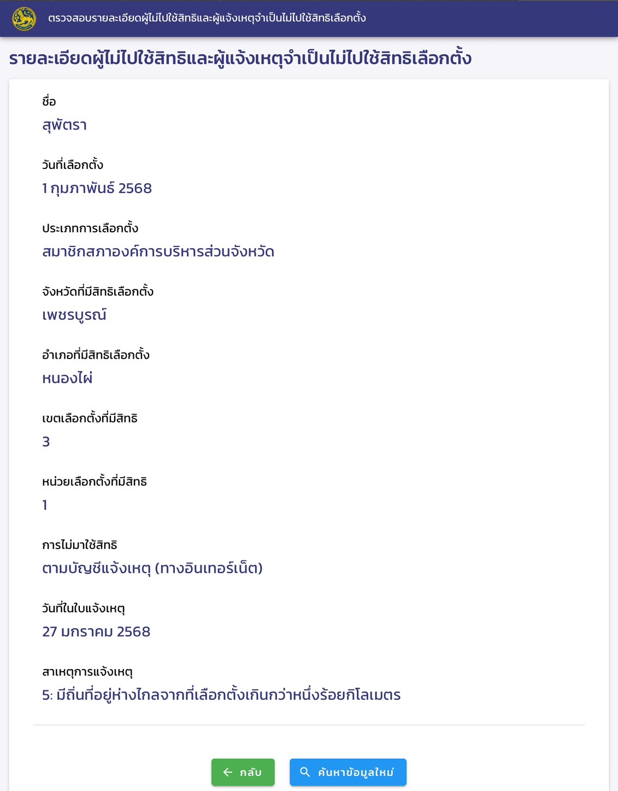

# การเลือกตั้งอบจ. 2568 🗳️

---

## การเลือกตั้ง สมาชิกสภาองค์การบริหารส่วนจังหวัด และ นายกองค์การบริหารส่วนจังหวัดเพชรบูรณ์

วันที่ในการเลือกตั้ง : วันเสาร์ที่ 1 กุมภาพันธ์ พ.ศ.2568

สถานที่เลือกตั้ง :  โรงเรียนบ้านปางยาง ต.ท่าด้วง อ.หนองไผ่ จ.เพชรบูรณ์

เหตุผลที่ไม่สามารถไปใช้สิทธิ์ในการเลือกตั้ง : มีถิ่นที่อยู่ห่างไกลจากที่เลือกตั้งเกินกว่าหนึ่งร้อยกิโลเมตร
